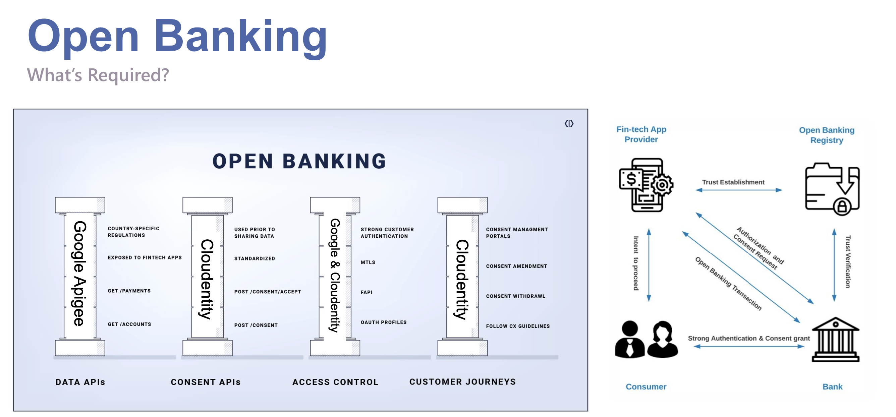
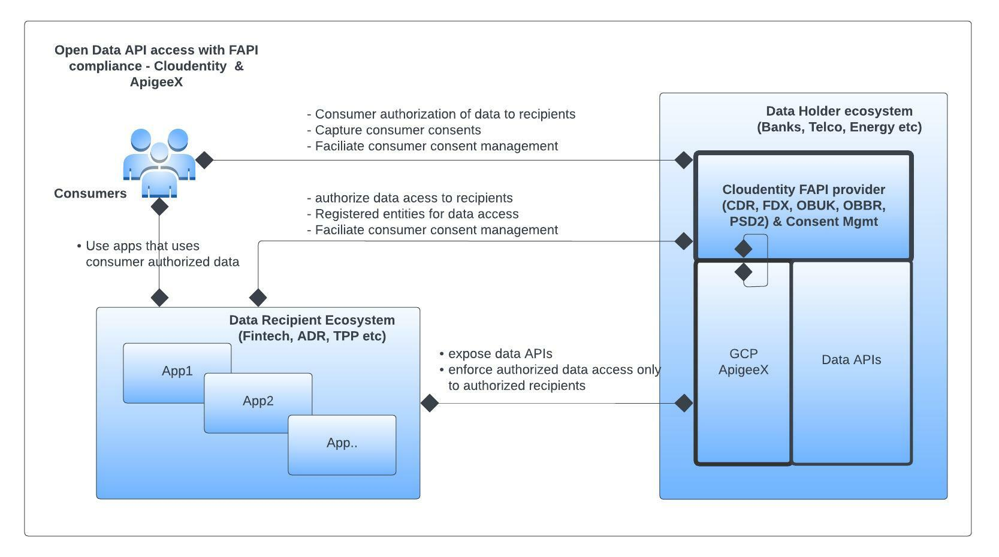
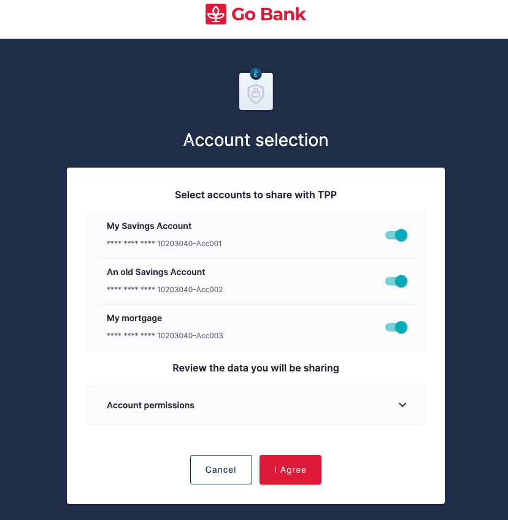
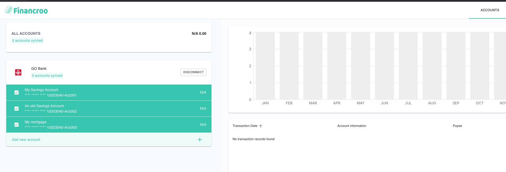

# Overview

Using Cloudentity and ApigeeX platforms in conjunction enables faster implementation of secure openbanking solutions
for organizations to securely share data with their partners and registered entities as per
regulations.



 Cloudentity platform provides the capability for consumer consent management, registration and management of third parties, communication with registry etc., while ApigeeX exposes the data APIs and enforces secure access of consumer data APIs as per regulations and compliance.  Cloudentity provides the open banking security profile implementation for data holder ecosystem and ApigeeX works in tandem with Cloudentity to ensure data is released only to authorized entities and enforce active consumer consent checks on requested data as per open banking regulations.



# Steps

## Required systems

* [Cloudentity SaaS tenant](https://developer.cloudentity.com/get_started/getting_started_with_cloudentity_access_management/)
* [Google Cloud Project](https://cloud.google.com/resource-manager/docs/creating-managing-projects#creating_a_project)
* [ApigeeX SaaS tenant](https://cloud.google.com/apigee). You can provision a free evaluation instance by following these [instructions](https://cloud.google.com/apigee/docs/api-platform/get-started/eval-orgs)

## Configure

### Configure Cloudentity and ApigeeX

Configure Cloudentity and ApigeeX to facililate CDR flow, manage customer consents, and issue CDR compliant
access tokens. A script is provided to facilitate the creation and configuration of the required resources.

There are three steps required when running the script:

1. [Create a Cloudentity Admin workspace](#Create-a-Cloudentity-Admin-workspace)
2. [GCP Configuration Steps](#GCP-Configuration-Steps)
3. [Run Configuration Script](#Run-Configuration-Script)

>Note: A step-by-step guide for deploying all resources manually can be found [here](/openbanking/README_DETAILED.md).

#### Create a Cloudentity Admin workspace

* Create a client in Admin workspace
   * Create a client application in Cloudentity Admin workspace. Detailed instructions can be found at [Cloudentity docs](https://developer.cloudentity.com/howtos/tenant_configuration/adding_workspaces/).
   * In the newly created client application
      * under the OAuth tab set Grant Types to `Client credentials`
      * under the OAuth tab set Token Endpoint Authentication Method to `Client Secret Basic`
      * Make note of the `CLIENT ID` and `CLIENT SECRET` which will be used to set environment variables in the next section
      * Make note of your domain, ie `my-tenant-domain.us.authz.cloudentity.io`
      * Copy your tenant ID - this can be found in the top right under `Profile`
* Update the environment variables for the Cloudentity setup script
   * In the repository under the `deploy` folder locate the `ce_admin.env` file and add the environment variables that were copied previously
      * CLIENT_ID - admin client application id
      * CLIENT_SECRET - admin client application secret
      * DOMAIN - domain - i.e .my-demo-tenant.us.authz.cloudentity.io
      * TENANT_ID - tenant id, i.e. my-demo-tenant
      * WORKSPACE_ID - your desired workspace id without spaces

Next, prepare GCP and ApigeeX

#### GCP Configuration Steps

1. __Prerequisites:__ In order to run the deployment script you need the following prerequisites:
   - __gcloud__, Google Cloud CLI tool. Installation instructions: https://cloud.google.com/sdk/docs/install
   - __jq__. If using Linux, install it by running: `sudo apt-get install jq`
   - __apigeecli__, tool to manage Apigee entities. Download the appropriate binary for your platform from https://github.com/apigee/apigeecli/releases

2. In the repository under the `deploy` folder locate the `ce_admin.env` file and add the following environment variables from your ApigeeX project:
   - GCP_PROJECT_ID - GCP project ID
   - GCP_REGION - GCP region
   - APIGEE_X_ENDPOINT - host without https:// for the apigeex proxy
   - APIGEE_X_ENV - **Optional**: only edit if not using eval environment

#### Run Configuration Script

The configuration script performs the following:
 - Creates and configures a Demo Consent application and Financroo data recipient application in your Cloudentity workspace for the ApigeeX proxies
 - Adds the redirect URI to Cloudentity OAuth server for the Financroo application
 - Add the consent application login URL in Cloudentity OAuth server
 - Sets the certificates and authentication methods in Cloudentity OAuth server
 - Adds ApigeeX artefacts that implement the Banking data APIs. They return mock data
 - Deploys *Demo consent application* as a GCP Cloud Run Function: This application talks to Bank APIs exposed by ApigeeX & Cloudentity APIs to gather and store consent within Cloudentity
 - Deploys *Demo client* as a GCP Cloud Run Function: To test this solution, we will use the Financroo data recipient app. This is a Data Recipient app that can interact with Bank APIs to use customer data after obtaining customer consent

Having configured the Cloudentity apps and ApigeeX proxies, in terminal, enter the following to start the configuration script from the root of the repo:
```bash
    cd openbanking
    deploy/setup-ce.sh full-deploy
```

This script can take awhile depending on your internet connection. Once complete the terminal should show
```bash
===================================================================================================
 The demo client app has now been deployed.
 You can test this solution by accessing the
 demo client app at:
   <demo application URL will appear here>
=================================================
Done
```

## Verifying the application.

* Launch financroo URL obtained from above deployment.

* Use test user to login to Financroo. This login is served by Financroo itself with an inbuilt auth
    `test/p@ssw0rd!`

* Connect to "Go Bank"

* User will be redirected to "Go Bank" Identity provider which is the mock idp we configured

* Login with `user/p@ssw0rd!`

* User will be redirected to consent app hosted in GCP to provide consent
    * Select accounts and provide consent. Consent app reaches out to ApigeeX exposed Bank APIs to fetch accounts for this user identified with `customer_id`

   

* Once consent is collected, and submitted to Cloudentity, Cloudentity mints CDR compliant tokens
and redirects user back to financroo  app

* Now financroo requests "Go Bank" accounts, balances & transactions APIs using above CDR accessTokens

* Go Bank APIs are exposed & protected by ApigeeX and the user consent and CDR accessToken is issued by Cloudentity. ApigeeX checks with Cloudentity to ensure customer consent is in place before returning data to Financroo




### Undeploying the solution

You can remove the CDR workspace by running the following from the `openbanking` directory 
```` bash
deploy/setup-ce.sh delete-workspace
````

You can then remove the GCP artefacts by running the following from the `openbanking` directory 
```` bash
deploy/undeploy_consent_mgmt_solution.sh <PATH_TO_YOUR_ENVIRONMENT_CONFIGURATION_FILE>
````
