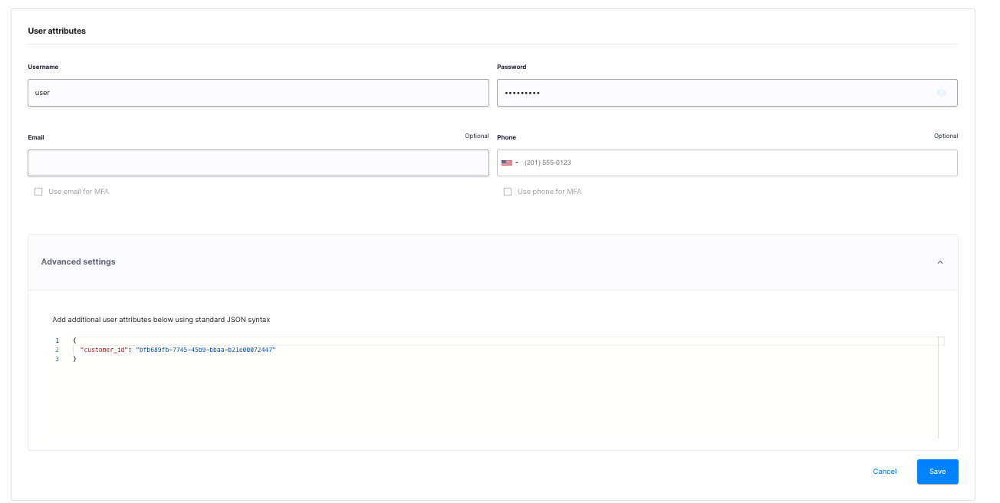
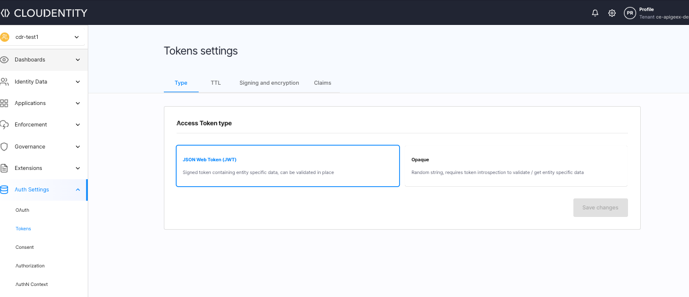
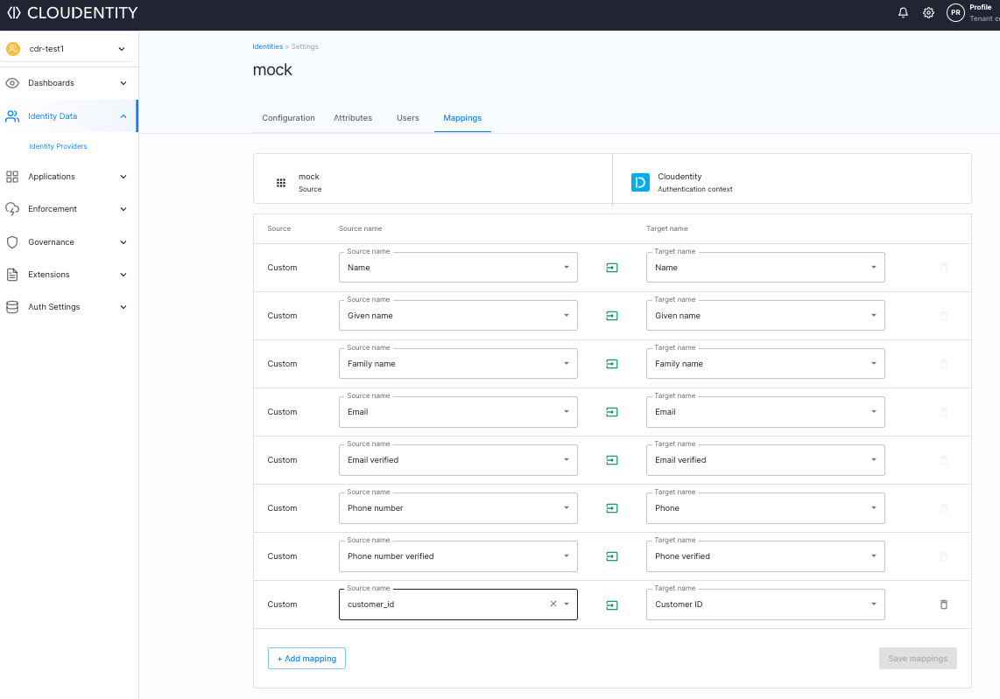
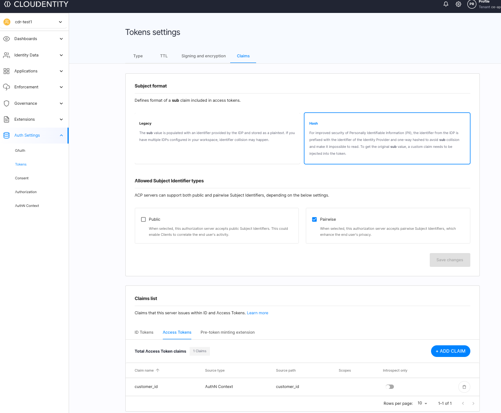
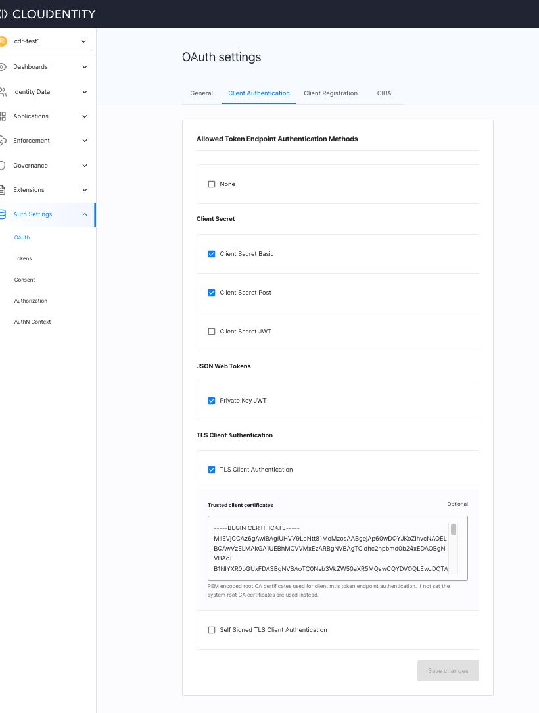
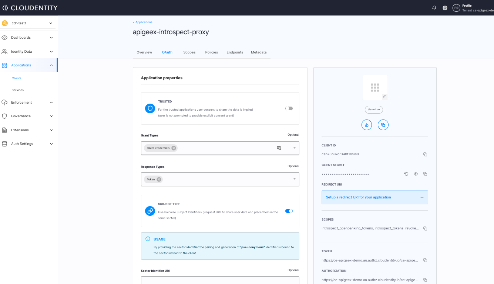
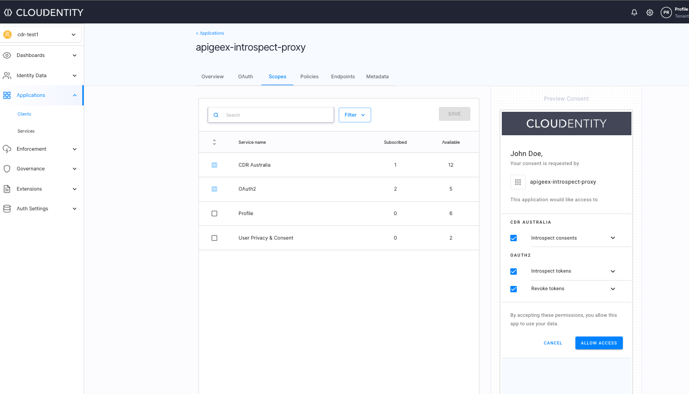
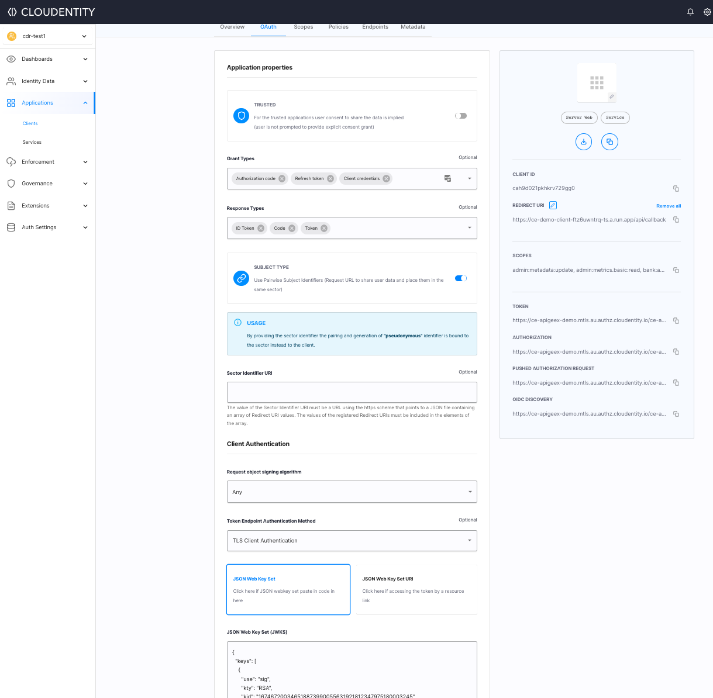
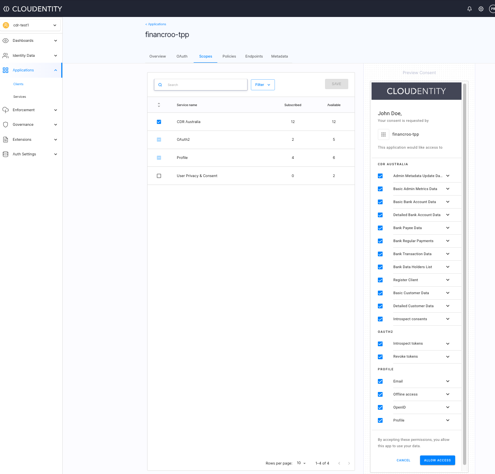

# Overview

Using Cloudentity and ApigeeX platforms in conjunction enables faster implementation of secure openbanking solution
for organizations to securely share data with their partners and registered entities as per
regulations.


 Cloudentity platform provides the capability for consumer consent management, registration and management of third parties, communication with registry etc while ApigeeX exposes the data APIs and enforces secure access of consumer data APIs as per regulations and compliance.  Cloudentity provides the open banking security profile implementation for data holder ecosystem and Apigeex works in tandem with Cloudentity to ensure data is released only to authorized entities and enforce active consumer consent checks on requested data as per open banking regulations. 


# Steps

## Required systems

* [Cloudentity SaaS tenant](https://developer.cloudentity.com/get_started/getting_started_with_cloudentity_access_management/)
* [ApigeeX SaaS tenant](https://cloud.google.com/apigee)  

## Configure

### Cloudentity

Let's configure Cloudentity to facililate CDR flow and manage customer consents and issued CDR compliant
access tokens

### Create Cloudentity workspace

* Create an open banking compliant workspace
    * Create [a new workspace within Cloudentity that represents the concept of an independent OAuth/OIDC authorization server within Cloudentity](https://developer.cloudentity.com/howtos/tenant_configuration/adding_workspaces/). Let's choose a [CDR compliant workspace](https://developer.cloudentity.com/howtos/cdr/cdr_workspace/) for this walkthrough.

    * Connect workspace to an identity provider. For this demo, let us choose sandbox Identity provider and create a set of users. In the advanced settings, let's add this customer id that will be used to correlate a banking user customer id within the APIs exposed by ApigeeX.

    ```
    {
    "customer_id": "bfb689fb-7745-45b9-bbaa-b21e00072447"
    }
    ```

    

    * Skip developer portal

### Configure Cloudentity workspace   

Now that we have created a CDR compliant workspace, let's go ahead and apply some settings

* Set token type to `JWT` instead of opaque

For the sake of simplicity, let's swith the token type to `JWT` instead of opaque.



* Map `customer_id` from sandbox idp to Cloudentity auth context

Sandbox idp is the identity provider and we have to map the `customer_id` from the identity provider
to Cloudentity auth context as an attribute, so that it can be later utilized to be mapped to outbound tokens
issued by Cloudentity



* Add `customer_id` to access token claim

Now let's release the attribute as a claim in access token to be used by ApigeeX.




* Add trusted TLS certificate

Add trusted TLS certificate that will be used by Financroo app using mTLS to obtain CDR compliant token access token from
Cloudentity.


```sh
-----BEGIN CERTIFICATE-----
MIIEVjCCAz6gAwIBAgIUHVV9LeNtt81MoMzosAABgejAp60wDQYJKoZIhvcNAQEL
BQAwVzELMAkGA1UEBhMCVVMxEzARBgNVBAgTCldhc2hpbmd0b24xEDAOBgNVBAcT
B1NlYXR0bGUxFDASBgNVBAoTC0Nsb3VkZW50aXR5MQswCQYDVQQLEwJDQTAeFw0y
MTAxMjAwOTQ4MDBaFw0yNjAxMTkwOTQ4MDBaMIGQMQswCQYDVQQGEwJVUzEUMBIG
A1UECBMLV2FzaGluZ2h0b24xEDAOBgNVBAcTB1NlYXR0bGUxFDASBgNVBAoTC0Ns
b3VkZW50aXR5MRYwFAYDVQQLEw1BdXRob3JpemF0aW9uMSswKQYDVQQDEyJjaWQx
LmF1dGhvcml6YXRpb24uY2xvdWRlbnRpdHkuY29tMIIBIjANBgkqhkiG9w0BAQEF
AAOCAQ8AMIIBCgKCAQEA4b/IX1bV29pw6/Ce8DdkoNx4dxJnDD9AyxmTG2z99cvl
HG6BJaMF6l09ncGXGbv3dufDKrhftkwfbTBdpUEAeext/ugCmXTV06Fayva6Iq7x
CNE8pA6hJT1y3Edsqq3IU8KVivYjYwd/vrSUfCe8pQRsR6K8rqnJ66ryn0yewkTE
yCgPIv6pOMbgq1d5iX/2G9rZNhj74miN5y4fy0tsbI3q2RUOzt2d+htkoysqu3Xt
a6qPA3vEJ2FnQo3dhgw4XSCEvjz+HSGnsTC+XBv6j6jI9SD5jI2UYqnyDcYmRHPJ
x2sQ/c8aLYHRdZxrxqIxUzulS6g0x74E2m0gBMKF5wIDAQABo4HfMIHcMA4GA1Ud
DwEB/wQEAwIFoDAdBgNVHSUEFjAUBggrBgEFBQcDAQYIKwYBBQUHAwIwDAYDVR0T
AQH/BAIwADAdBgNVHQ4EFgQUt+G5I2aokd3gFFMty1rsIT8yMuwwHwYDVR0jBBgw
FoAUylkHhGQUSf1DtT8uxH02jqlbo20wXQYDVR0RBFYwVIIJbG9jYWxob3N0giJj
aWQxLmF1dGhvcml6YXRpb24uY2xvdWRlbnRpdHkuY29tgh1hdXRob3JpemF0aW9u
LmNsb3VkZW50aXR5LmNvbYcEfwAAATANBgkqhkiG9w0BAQsFAAOCAQEAjKXSkhqk
L7tpjk5KbQe8OIvpsR0EjO3Za2KsvzUGDQzE+3tqL3jDvAhqWpICGGzv0kkroveb
0kXc2Ltc5a+EQtm5l100N0kMB8f11/B1tcLFWQQnqEPB4RTkesGv70e1C3LbjmgJ
bE62cLR8X2dXr20HxUMZAzmlDdRZS/80YnXSDgjcWxDiFVitFbFeUyYF/oh4RmO5
HQKvMEd3XIO/hWKp0Jv2G4B5IwtWm2ZodaM6zwMgX0BBp1LUsSF5OYDjuJ2Tq8da
EGmUj5Y/+CroeW7nFDgAwt+1x3M76uT8fo+rP+UHweR8TCSq28dY3+N8UYrD5YIB
ZD/0ro2b2KVvgg==
-----END CERTIFICATE-----
```




### Register a consent application

CDR requires a good and informed CX for collecting customer consents to share data with third party providers. In this demonstration, we will be handing off the consent collection responsibility to a demo consent application running in GCP which will interact with Cloudentity APIs & ApigeeX APIs to display, collect and store customer consents for their bank accounts to be shared with third party app(Financroo).

[Register a custom CDR compliant consent app within Cloudentity](https://developer.cloudentity.com/howtos/cdr/build_cdr_consent_apps/#configure-consent-application-in-cloudentity). For now let's provide a dummy url for 
the custom consent page(in case you don't have one already) to get the communication credentials for the custom consent app to interact with Cloudentity. Note that we have a demo consent app that we will deploy later onto GCP and once
that is deployed, the URL can be updated here.

### Register a trusted application for ApigeeX to interact with Cloudentity

We need to create a trusted application in Cloudentity that will be utilized by ApigeeX to
introspect and verify CDR compliant access tokens issued by Cloudentity.

* Create a `trusted` [OAuth client application in Cloudentity](https://developer.cloudentity.com/howtos/applications/connecting_and_configuring_client_apps/) for ApigeeX to introspect Cloudentity issued access tokens

* Client name as `apigeex-introspect-proxy`
* Choose Grant type as `Client Credentials`



* Let's configure the scopes
    * Move to scopes tab and ensure all the scopes for CDR requirements are subscribed to



### Register an OAuth client application for Financroo 

To demonstrate an end to end CDR flow, we need a data recipient app. In this exercise we will utilize the Financroo
app as the ADR. For sake of simplicity, we will not do the DCR, ADR validation etc rather create and application
that represents a data recipient app.

* Create an [OAuth client application in Cloudentity](https://developer.cloudentity.com/howtos/applications/connecting_and_configuring_client_apps/) for ApigeeX to act as the ADR application. Ideally this needs to be done using a DCR flow but it this tutorial skips the registration mechanism.
* Client name as `financroo-tpp`
* Choose Grant type as `Authorization code` , `Refresh Token` & `Client Credentials`
* Under Client Authentication
    * Choose Token Endpoint Authentication Method as `TLS Client Authentication`
    * Configure JSON Web Key Set that includes the public key of the TLS Cert

        ```json
        {
        "keys": [
            {
            "use": "sig",
            "kty": "RSA",
            "kid": "167467200346518873990055631921812347975180003245",
            "alg": "RS256",
            "n": "4b_IX1bV29pw6_Ce8DdkoNx4dxJnDD9AyxmTG2z99cvlHG6BJaMF6l09ncGXGbv3dufDKrhftkwfbTBdpUEAeext_ugCmXTV06Fayva6Iq7xCNE8pA6hJT1y3Edsqq3IU8KVivYjYwd_vrSUfCe8pQRsR6K8rqnJ66ryn0yewkTEyCgPIv6pOMbgq1d5iX_2G9rZNhj74miN5y4fy0tsbI3q2RUOzt2d-htkoysqu3Xta6qPA3vEJ2FnQo3dhgw4XSCEvjz-HSGnsTC-XBv6j6jI9SD5jI2UYqnyDcYmRHPJx2sQ_c8aLYHRdZxrxqIxUzulS6g0x74E2m0gBMKF5w",
            "e": "AQAB"
            }
        ]
        }
        ```
    * Choose Certificate Metadata as `TLS_CLIENT_AUTH_SUBJECT_DN`
    * Set Subject Distinguished Name as `CN=cid1.authorization.cloudentity.com,OU=Authorization,O=Cloudentity,L=Seattle,ST=Washinghton,C=US`
    * Enable `Certificate bound access tokens`

    

    * Let's configure the scopes
        * Move to scopes tab and ensure all the scopes for CDR requirements are subscribed to

    


### ApigeeX

* Expose open banking data APIs
    // TODO: 

* Deploy shared flows
    // TODO: 

* Configure shared flows
    * Configure Cloudentity connection settings // TODO:  


## Run Financro & Consent App in Google Cloud                

We will run 2 demo applications in GCP cloud run environment.
* Custom consent application - This application talks to Bank APIs exposed by ApigeeX & Cloudentity APIs to gather and store consent within Cloudentity 
* Financroo - Data Recipient app that can interact with Bank APIs to use customer data
after obtaining customer consent.

To deploy demo applications in GCP, 

* Obtain Cloudrun YAML file
 Users can use the provided Cloudrun YAML file, and then deploy the applications onto GCP Cloudrun platform within minutes

 // TODO(): Put the github URL with Cloud run templates

* Configure Cloudrun YAML file

To integrate and talk to Cloudentity & APigeeX properly, the file needs to be configured 
with appropriate secrets & endpoints

 * Configuring consent App

    Consent app needs to configured to set the following URL

    environment:
      - ISSUER_URL=https://ce-apigeex-demo.au.authz.cloudentity.io/ce-apigeex-demo/system
      - CLIENT_ID=<REPLACE WITH CLOUDENTITY CONSENT APP CLIENT ID>
      - CLIENT_SECRET=<REPLACE WITH CLOUDENTITY CONSENT APP CLIENT SECRET>
      - LOG_LEVEL=debug
      - SPEC=cdr
      - GIN_MODE=debug # change to release to disable gin debug
      - OTP_MODE=mock # change to custom to enable custom OTP handling
      - MFA_CLAIM=sub # for mobile use mobile_verified
      - BANK_ID_CLAIM=customer_id
      - BANK_URL=<REPLACE WITH BANKING URL EXPOSED BY APIGEE URL>
      - BANK_CLIENT_TOKEN_URL=<REPLACE WITH APIGEE TOKEN ENDPOINT> 
      - BANK_CLIENT_ID=<REPLACE WITH APIGEE BANK CLIENT ID> 
      - BANK_CLIENT_SECRET=<REPLACE WITH APIGEE BANK CLIENT ID>
      - BANK_CLIENT_SCOPES=bank:accounts.basic:read,bank:accounts.detail:read
      - BANK_ACCOUNTS_ENDPOINT=<REPLACE WITH BANKING INTERNAL ACCOUNTS ENDPOINT EXPOSED BY APIGEE URL>

  * COnfigure Financroo APp

      Financroo app needs to configured to set the following URL
        *
            ```sh
            - ACP_MTLS_URL=<REPLACE WITH MTLS URL FROM CLOUDENTITY FINANCROO OAUTH CLIENT> (https://ce-apigeex-demo.mtls.au.authz.cloudentity.io/ce-apigeex-demo/cdr/oauth2/token)
            - TENANT=<REPLACE WITH CLOUDENTITY TENANT> (ce-apigeex-demo)
            - GIN_MODE=debug # change to release to disable gin debug
            - SPEC=cdr
            - OPENBANKING_SERVER_ID=<REPLACE_WITH_CLOUDENTITY_WORKSPACE_NAME>
            - BANK_URL=<REPLACE WITH BANKING URL EXPOSED BY APIGEE URL>
            - UI_URL=https://ce-demo-client-ftz6uwntrq-ts.a.run.app'
            - ENABLE_TLS_SERVER=false
            - CLIENT_ID=cah9d021pkhkrv729gg0'
            - DB_FILE=/tmp/my.db
        ```
* Now that both the apps have been configured and deployed, let's go ahead and deploy this in GCP.

## Verify the application.

* Launch financroo URL obtained from above deployment. For using the default demo sanbox use
    `https://ce-demo-client-ftz6uwntrq-ts.a.run.app/`

* Use test user to login to Financroo. This login is served by Financroo itself with an inbuilt auth
    `test/p@ssw0rd!`

* Connect to "Go Bank"

* User will be redirect to "Go Bank" Identity provider which is the mock idp we configured

* Login with `user/p@ssw0rd!`

* User will be redirected to consent app hosted in GCP to provide consent
    * Select accounts and provide consent. Consent app reaches out to ApigeeX exposed Bank APIs to fetch accounts for this user identified with `customer_id`

    

* Once consent is collected, and submitted to Cloudentity, Cloudentity mints CDR compliant tokens
and redirects user back to financroo  app

* Now financroo requests "Go Bank" accounts, balances & transactions APIs using above CDR accessTokens

* Go Bank APIs are exposed & protected by ApiGeex and the user consent and CDR accessToken is issued by Cloudentity. Apigeex checks with Cloudentity to ensure customer consent is in place before returning data to Financroo


